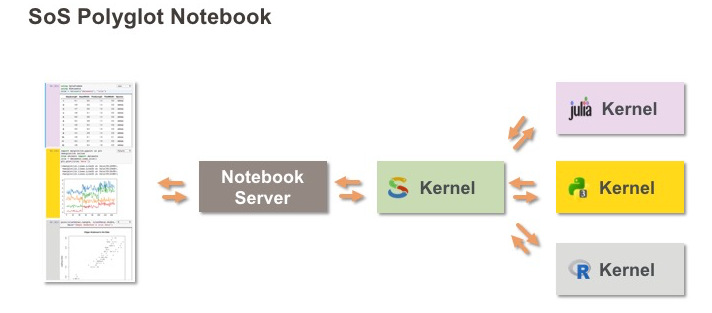

# SoS: Using multiple kernels in a notebook

[Script of Scripts](https://vatlab.github.io/sos-docs) is a Polyglot
Notebook and a workflow engine. Ignoring the workflow engine part, SoS
Notebook provides a SoS Kernel that acts as a super kernel to all Jupyter
kernels so that you can use multiple Jupyter kernels in a single Jupyter
notebook. Moreover, it provides a number of magics, most importantly `%get`
to exchange variables between live kernels.

## Use SoS with binder

Although it is almost trivial to install SoS, setting up multiple kernels
in a single binder environment is not very easy at this point. This repository
contains multiple branches that demonstrates how to do it for the languages
you are interested in. For more details, please refer to the [SoS
Documentation](https://vatlab.github.io/sos-docs) on how to set up
different kernels for SoS.

### The master branch

The master branch uses a `Docker` file to set up most kernels that SoS
supports. The docker file is derived from [Jupyter Notebook Data Science
Stack](https://github.com/jupyter/docker-stacks/tree/master/datascience-notebook) and contains the following kernels:

* Python 2 kernel for Python 2.7
* Python 3 kernel for Python 3.6
* [Bash kernel](https://github.com/takluyver/bash_kernel) for using bash commands
* [iJavaScript](https://github.com/n-riesco/ijavascript) for node.js
* [iJulia](https://github.com/JuliaLang/IJulia.jl) for Julia
* [ir](https://github.com/IRkernel/IRkernel) kernel for R
* [Octave Kernel](https://github.com/Calysto/octave_kernel) for octave
* [SPARQL kernel](https://github.com/paulovn/sparql-kernel) for Sparql, included to demonstrate how SoS works with
  any Jupyter kernel (not in a language that SoS understands)

SoS also supports other languages such as Ruby, MATLAB, and SAS but they
are not included since this image is already very big.

This branch includes mostly examples for a talk on SoS during JupyterCon2018. You can watch the talk on Youtube
using [this link](https://www.youtube.com/watch?v=U75eKosFbp8) if you are intested in learning SoS.

### The Python-Julia branch

This branch is much more lightweight as it contains only Python 3, Julia,
and SoS kernels. It specifies the environment using

* `environment.yml`: an anaconda python environment, also installs SoS and SoS Notebook
* `REQURE`: a Julia environment with recommended packages
* `postBuild`: Post build command to install the SoS Kernel.

This branch contains a notebook `python-and-julia.ipynb` which demonstrates
how to use Python3 and Julia in a single Jupyter notebook.

### The Python-R branch

This branch contains only Python 3, R, and SoS kernels. It specifies the environment using

* `environment.yml`: an anaconda python environment, also installs SoS and SoS Notebook
* `runtime.txt`: specify version of R as [MRAN](https://mran.microsoft.com/) snapshots
* `install.R`: additional packages to install
* `postBuild`: Post build command to install the SoS Kernel.

This branch contains a notebook `python-and-r.ipynb` which demonstrates
how to use Python3 and R in a single Jupyter notebook.

